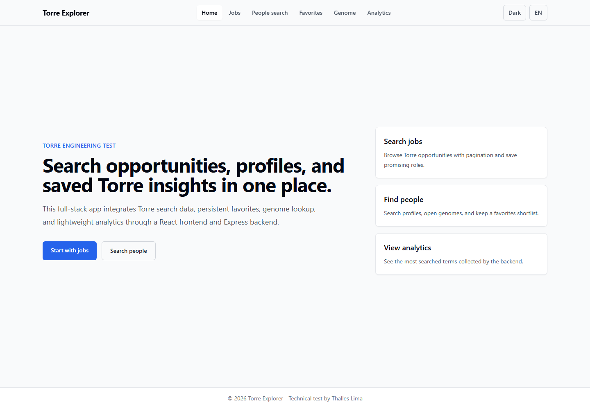
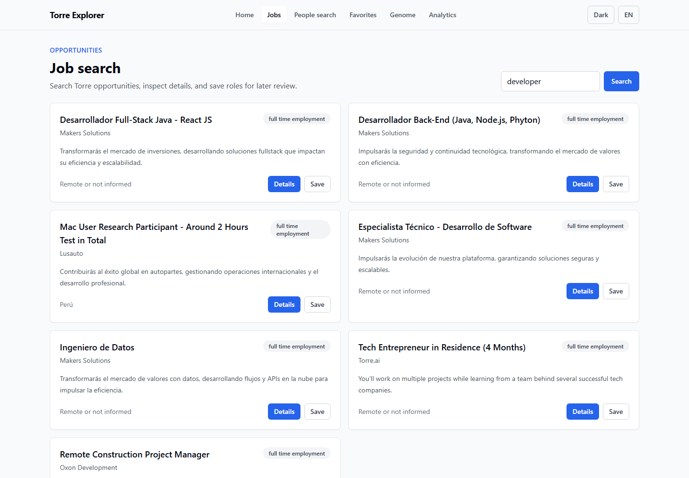
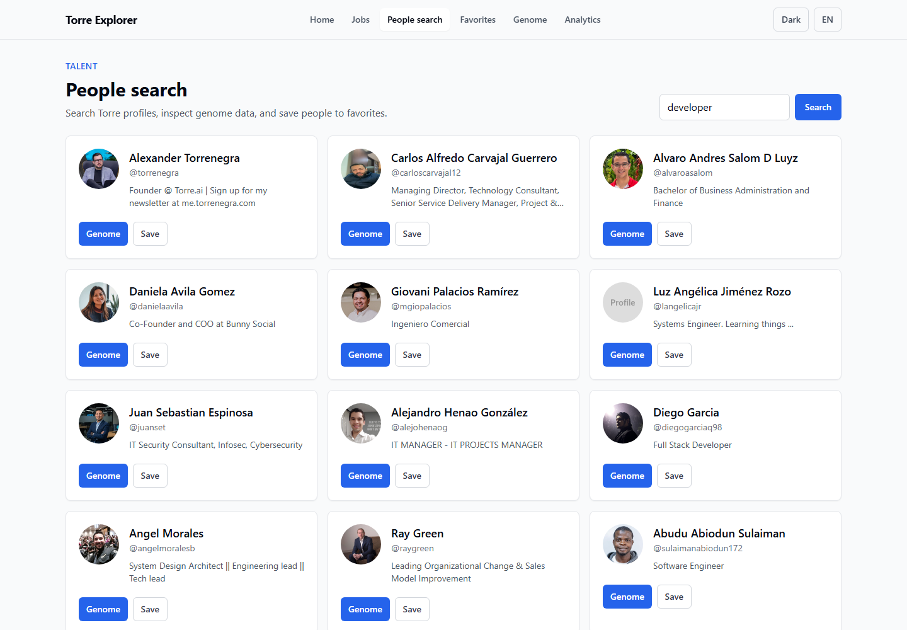
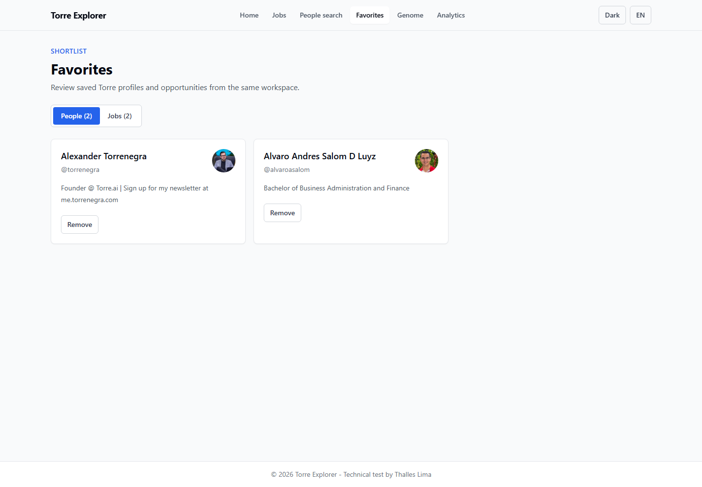
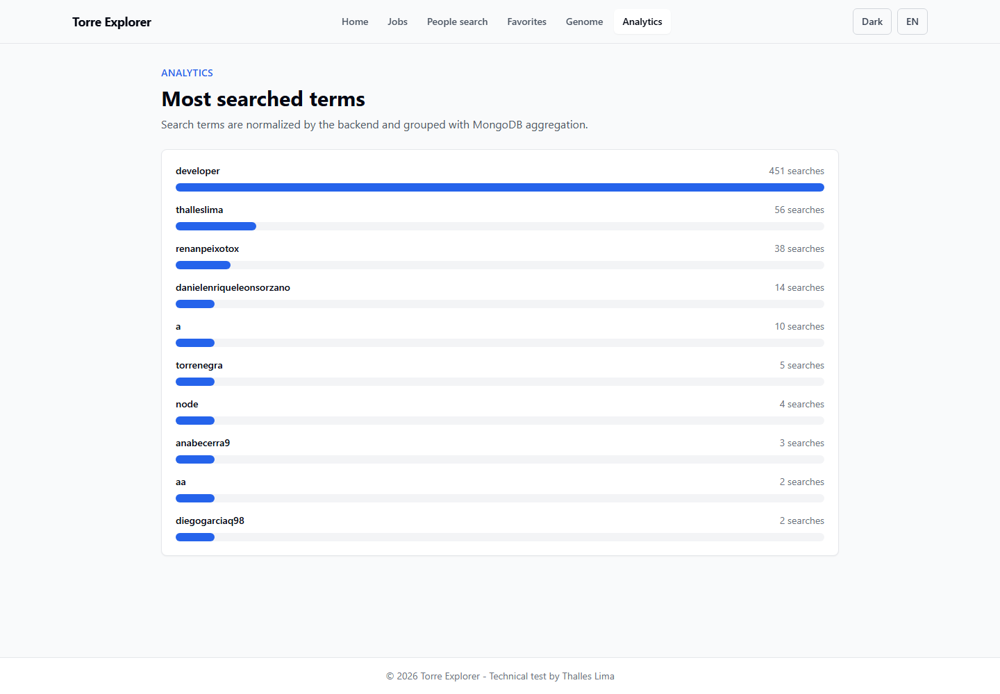
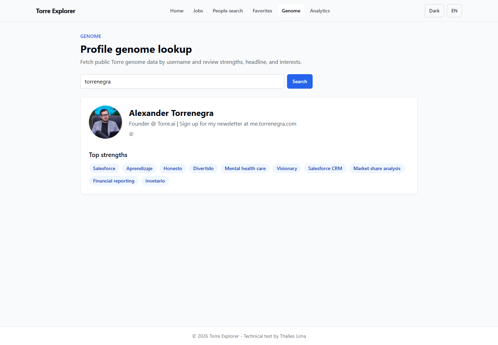

# Torre Engineering Technical Test v2.1

Full-stack solution for the Torre Engineering technical test. The app lets users search Torre jobs, search people, inspect public genome data, save favorite jobs/profiles, and view search analytics.

## Stack

**Frontend**
- React 19 with Vite
- React Router
- TanStack Query
- Tailwind CSS
- Axios
- Playwright E2E tests

**Backend**
- Node.js and Express
- MongoDB with Mongoose
- Express Validator
- Swagger setup
- Jest and Supertest

## Features

- Job search through `POST /api/torre/jobs`
- People search through `POST /api/torre/search`
- Genome lookup through `GET /api/torre/genome/:username`
- Favorites for both jobs and profiles
- MongoDB aggregation for most searched terms
- Responsive UI with dark mode, empty states, loading states, and error feedback
- Client-side server-state caching with TanStack Query
- Backend in-memory caching for repeated Torre API responses
- Backend validation and targeted automated tests
- Playwright E2E coverage for jobs, people/genome, favorites, and analytics flows

## Screenshots

| Home | Job search |
| --- | --- |
|  |  |

| People search | Favorites |
| --- | --- |
|  |  |

| Analytics | Genome |
| --- | --- |
|  |  |

## Project Structure

```text
backend/
  src/
    controllers/
    middlewares/
    models/
    routes/
    services/
    validators/
  __tests__/

torre-frontend/
  src/
    layouts/
    pages/
    services/
    hooks/
    i18n/
```

## Environment

Backend `.env`:

```env
PORT=3001
MONGO_URI=your_mongodb_connection_string
FRONTEND_URL=http://localhost:5173
TORRE_CACHE_TTL_MS=300000
TORRE_CACHE_MAX_ITEMS=100
```

Frontend `.env`:

```env
VITE_BACKEND_URL=http://localhost:3001
```

For local development, set `VITE_BACKEND_URL` to `http://localhost:3001`. For deployment, point it to the Render backend URL.
Use the committed `.env.example` files as templates. Real `.env` files are ignored and should stay local.

## Security Notes

- `MONGO_URI` must be provided through environment variables only. Do not commit real `.env` files or database credentials.
- For local development, put `MONGO_URI` in `backend/.env`.
- For Render, set `MONGO_URI` in the service environment variables panel.
- Use a strong MongoDB Atlas database-user password. Generate a long random password, update it in Atlas, then update both local `backend/.env` and Render's `MONGO_URI`.
- Restrict MongoDB Atlas Network Access when possible. `0.0.0.0/0` is convenient for demos, but a narrower allowlist is safer for production.
- If a credential was ever committed, rotate it immediately. Cleaning Git history with BFG Repo-Cleaner or `git filter-repo` is ideal, but a rotated/dead credential is the critical security fix.

## Run Locally

```bash
cd backend
npm install
npm run dev
```

```bash
cd torre-frontend
npm install
npm run dev
```

Open the frontend at `http://localhost:5173`.

## Verification

Backend tests:

```bash
cd backend
npm test
```

Frontend checks:

```bash
cd torre-frontend
npm run lint
npm run build
npm run test:e2e
```

Current verification from this workspace:
- Backend: 5 test suites passed, 12 tests passed
- Frontend: lint passed
- Frontend: production build passed
- Frontend E2E: Playwright core flows passed

## CI

GitHub Actions runs on pushes and pull requests to `main`:

- Backend: `npm ci` and `npm test`
- Frontend: `npm ci`, Playwright browser install, `npm run lint`, `npm run build`, and `npm run test:e2e`

Workflow file: `.github/workflows/ci.yml`.

## Deployment Notes

Backend on Render:
- Set `MONGO_URI` as a Render environment variable.
- Set `FRONTEND_URL` or `FRONTEND_URLS` to the deployed Vercel frontend domain.
- Optionally tune `TORRE_CACHE_TTL_MS` and `TORRE_CACHE_MAX_ITEMS` for the backend cache.
- Keep the local `backend/.env` out of Git.

Frontend on Vercel:
- Set `VITE_BACKEND_URL` to the Render backend URL.
- The project includes `torre-frontend/vercel.json` so React Router routes rewrite to `index.html`.

## API Summary

| Method | Endpoint | Purpose |
| --- | --- | --- |
| `POST` | `/api/torre/jobs` | Search job opportunities by `term`, `offset`, and `limit` |
| `POST` | `/api/torre/search` | Search people/profiles by text |
| `GET` | `/api/torre/genome/:username` | Fetch a public Torre genome profile |
| `POST` | `/api/torre/favorites` | Save a job or profile favorite |
| `GET` | `/api/torre/favorites` | List favorites by `userId` and optional `type` |
| `DELETE` | `/api/torre/favorites/:id` | Remove a favorite |
| `GET` | `/api/torre/analytics` | Return top searched terms |

## Recent Quality Improvements

- Fixed frontend/backend job search contract mismatch.
- Removed broken encoded UI text and standardized visible copy.
- Added job favorites to match the stated requirements.
- Added useful empty/loading/error states across the frontend.
- Fixed duplicate CORS configuration and i18n path.
- Added security headers with Helmet.
- Added Playwright E2E tests for core user flows.
- Added bounded in-memory caching for repeated Torre API responses.
- Added a unique MongoDB favorite index.
- Updated backend tests for jobs, favorites, analytics, validation, and health/version routes.

## Future Improvements

- Add real authentication instead of the current `guest` user.
- Add frontend component tests.
- Add deployment URLs and screenshots when the final hosted frontend is available.
