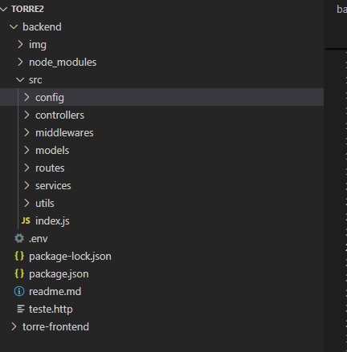
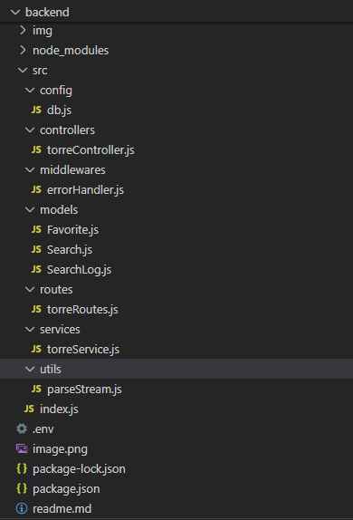

# 🧠 TorreEngineering Backend

This is the backend for the **Torre Engineering Technical Challenge v2.1**, built with **Node.js + Express + MongoDB**. It handles API integrations with Torre.co's public endpoints and provides functionality for job search, genome retrieval, favorites management, and analytics tracking.

---

## 🚀 Overview

This backend exposes a RESTful API for:

- 🔍 Searching jobs via Torre’s public search endpoint
- 🧬 Fetching genome data for any Torre user
- ⭐ Saving and listing favorite jobs or profiles
- 📊 Retrieving the most searched terms for analytics
- ⚠️ (Optional) Streaming entity search via NDJSON (disabled — requires auth)

---

## 📁 Folder Structure






Editar

---

## ⚙️ Setup & Installation

### 1. Configure Environment

Copy `.env.example` to `.env` and fill in your values:

```env
PORT=3001
MONGO_URI=your_mongodb_connection_string
2. Install Dependencies


Editar
cd backend
npm install
3. (Optional) Add Nodemon for Dev Mode


Editar
npm install --save-dev nodemon
Then update package.json:

json

Editar
"scripts": {
  "start": "node src/index.js",
  "dev": "nodemon src/index.js"
}
4. Run the Server

```
Editar
npm run dev
📌 Key Files
src/index.js: Main Express app setup (middlewares, MongoDB, routes)

src/controllers/torreController.js: Request handling & DB interaction

src/services/torreService.js: External Torre API integrations

src/models/: MongoDB schemas for favorites and search tracking


## 📌 Key Files (Detailed Overview)

| File                                  | Description |
|---------------------------------------|-------------|
| `src/index.js`                        | Initializes the Express app, connects to MongoDB, applies global middleware, and mounts all routes. |
| `src/controllers/torreController.js`  | Handles HTTP requests and interacts with the database and external APIs via services. |
| `src/services/torreService.js`        | Contains logic to integrate with Torre’s public API endpoints like job search and genome. |
| `src/models/`                         | Includes Mongoose models for `Favorite`, `Search`, and `SearchLog`, used for storing user favorites and tracking analytics. |
| `src/utils/parseStream.js`            | (Optional) Utility for parsing NDJSON streams from Torre (used in entity search - currently disabled). |

---

## 🔌 API Endpoints

| Method | Endpoint                              | Description                              |
|--------|----------------------------------------|------------------------------------------|
| GET    | `/api/torre/genome/:username`         | 🔬 Fetches genome (skills/traits) for a given Torre user. |
| POST   | `/api/torre/jobs`                     | 💼 Public job search (uses Torre’s opportunities endpoint). |
| POST   | `/api/torre/favorites`                | ⭐ Saves a job or profile to favorites in MongoDB. |
| GET    | `/api/torre/favorites`                | 📋 Lists favorites filtered by user ID and type. |
| DELETE | `/api/torre/favorites/:id`            | ❌ Deletes a favorite entry by its unique ID. |
| GET    | `/api/torre/analytics`                | 📊 Retrieves most searched terms (via MongoDB aggregation). |
| POST   | `/api/torre/search`                   | ⚠️ (Disabled) Intended for entity streaming search with NDJSON (requires auth). |

---

## 🧪 Notes & Architecture

- ✅ **Database**: Uses **MongoDB Atlas** for remote persistence.
- 🔐 **Authentication**: Not required — all endpoints use Torre’s **public APIs**.
- 🔄 **Modular Design**: Follows clean separation of concerns (controllers, services, models).
- 🧠 **Analytics**: Tracks user search terms in `SearchLog` model for insights.
- ♻️ **Favorites**: Stores saved job or profile data with user ID reference.

🧩 **Designed to work seamlessly with the TorreEngineering Frontend**.


