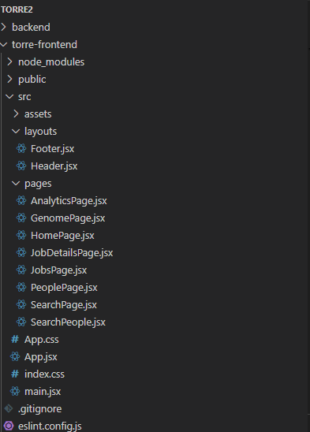
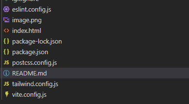

# Criar um arquivo README.md com o conteúdo em Markdown fornecido

markdown_content = """
# 💻 TorreEngineering Frontend

This is the frontend for the **Torre Engineering Technical Challenge v2.1**, built with **React + Vite + TailwindCSS v3.4.1**. It integrates with Torre’s public APIs and a custom backend to deliver a clean, responsive, and intuitive UI/UX.

---

## 🚀 Overview

A modern single-page application that allows users to:

- 🔍 Search for job opportunities by keyword  
- 👤 View user genomes (public profiles) by username  
- ⭐ Save and manage favorite jobs and people  
- 📊 View analytics of most searched terms  

Optimized for speed, usability, and mobile-first responsiveness.

---

## 📁 Folder Structure




---

## ⚙️ Setup & Installation

1. Clone the repository

```bash
git clone https://github.com/your-username/torre-frontend
cd torre-frontend

npm install
npm install react-router-dom
```
Run the development server
```bash
npm run dev
```
Open your browser at:

`http://localhost:5173`
## 📄 Main Components & Pages

| File             | Description |
|------------------|-------------|
| `JobsPage.jsx`   | 🔍 Job search page. Contains an input to search for jobs by keyword. Connects to `POST /api/torre/jobs` and displays job cards including role, company, and location. |
| `GenomePage.jsx` | 🧬 Genome viewer. Accepts a Torre username and fetches their genome data via `GET /api/torre/genome/:username`. Shows name, picture, strengths, weaknesses, and headline. |
| `SearchPage.jsx` | 👥 Profile search. Dynamically extracts members from Torre job results based on a keyword. Allows favoriting profiles and shows popular search terms below (analytics). |
| `PeoplePage.jsx` | ⭐ Favorites page. Lists all profiles favorited by the user and allows unfavoriting with a single click. |

---

## 🌐 Routing (via React Router)

```jsx
<Route path="/jobs" element={<JobsPage />} />
<Route path="/search" element={<SearchPage />} />
<Route path="/genome/:username" element={<GenomePage />} />
<Route path="/people" element={<PeoplePage />} />
```

---

## 🧠 Usage Instructions

- Navigate to `/jobs` → Type a keyword (e.g., `"developer"`) → See job listings from Torre
- Navigate to `/genome/:username` → Input a Torre username → View full genome data
- Navigate to `/search` → Type a skill (e.g., `"marketing"`) → See matching profiles → Favorite them
- Navigate to `/people` → Manage your favorite profiles (view & unfavorite)

🧩 Favorites and analytics are persisted using **MongoDB** via the backend API.

---

## 📦 API Communication

The frontend communicates with the backend at:

```
http://localhost:3001/api/torre
```

All Torre APIs used are **public** — no authentication required.
